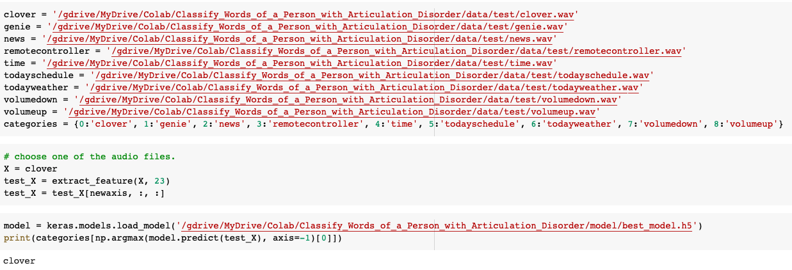

# Classifying Words of a Person with Articulation Disorder

1. Data
- 9 words, 89 each 
    - 뉴스(news), 리모컨(remote controller), 소리크게(volume up), 소리작게(volume down), 시간(time), 오늘일정(today schedule), 오늘날씨(today weather), 지니야(genie), 클로바(clova)
- why wav format? 
    - The wav format is uncompressed, being an exact copy of the source audio
- Train / Validation / Test = 55:17:17 = 0.6:0.2:0.2

2. Data Preprocessing
- change files
    - raw -> to_wav -> separated
        - clover70.m4a -> clover70.wav: online converter(https://convertio.co/m4a-wav/)
        - clover70.wav -> clover_0.wav ~ clover_69.wav: cut them one by one with 'WavePad'
    > |Data|Format|Audio Channel|Sample Rate|Bit per Sample|Encoding|
    > |---|---|---|---|---|---|
    > |raw|m4a|mono|44.1 kHz|16 bit|.|
    > |to_wav|wav|mono|44.1 kHz|16 bit|pcm|
    > |separated|wav|mono|44.1 kHz|16 bit|pcm|
- make train/test data
    - RenameFiles.py
        - rename separated raw data files on the local machine
    - DivideTrainValTest.py
        - divide files into trian files, validation files and test files on the local machine
    - ExtractFeature.py
        - extract MFCC features
        - decide the length of input same
        - normalize MFCC feature values to values between 0 and 1
        - store features into a npz file
    - MakeXFeatures.py
        - combine all npz files into one npz file for train, validation and test.
    - MakeLables.py
        - make y labels for train,validation and test
- Data
    - Data/test_X.npz
    - Data/test_y.npz
    - Data/train_X.npz
    - Data/train_y.npz
    - Data/val_X.npz
    - Data/val_y.npz

3. Train
- Train.ipynb
    - use the CNN algorithm to classify data that has been changed into images
    - The classification accuracy for version 1 with three layers of MLP was 75.56%
    - Version 2 with CNN has a classification accuracy of **96.08%**

4. Test
- Test.ipynb
    - confirm the result by input the test speech data into the trained model 
    